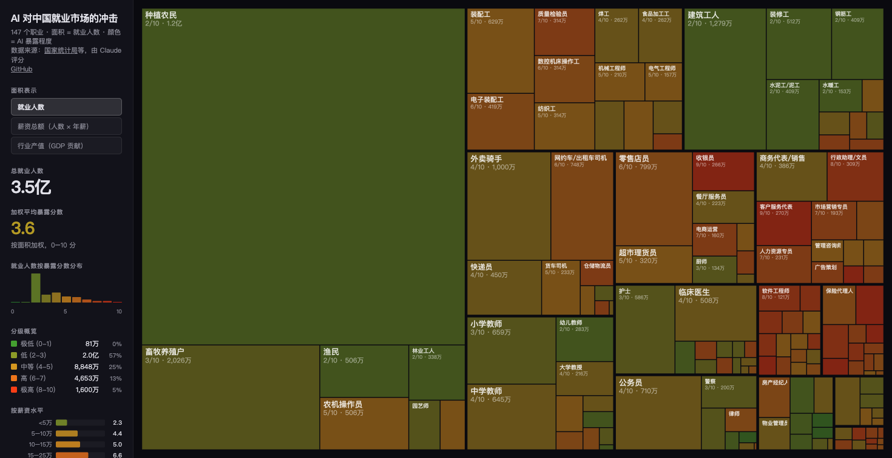

# AI 对中国就业市场的冲击

交互式可视化：分析 AI 对中国 ~150 个职业的暴露程度。

**[在线演示 →](https://mistysun19.github.io/ai-jobs-cn/)**



## 概述

本项目受 [Andrej Karpathy 的美国就业市场 AI 暴露分析](https://joshkale.github.io/jobs/) 启发，针对中国劳动力市场进行了本土化改编。

使用 Treemap（矩形树图）可视化中国约 150 个职业的 AI 暴露程度：
- **面积** = 就业人数
- **颜色** = AI 暴露评分（绿色→安全，红色→高暴露）

## 数据来源

- 就业人数、薪资、学历要求等数据参考国家统计局及人力资源和社会保障部公开数据
- AI 暴露评分（0-10 分）由大语言模型基于职业描述生成

## AI 暴露评分标准

| 分数 | 等级 | 示例职业 |
|------|------|----------|
| 0-1 | 极低 | 建筑工人、清洁工、农民 |
| 2-3 | 低 | 电工、水管工、护士、消防员 |
| 4-5 | 中等 | 教师、零售、医生 |
| 6-7 | 较高 | 管理人员、工程师、会计 |
| 8-9 | 很高 | 软件开发、金融分析师、翻译、编辑 |
| 10 | 极高 | 数据录入员 |

核心判断依据：**工作产出是否本质上是数字化的** — 如果一份工作可以完全在电脑前完成，AI 暴露天然就高。

## 本地运行

```bash
# 任意 HTTP 服务器均可
python3 -m http.server 8000

# 然后访问 http://localhost:8000
```

## 技术栈

- D3.js v7 — Treemap 布局计算
- 原生 HTML/CSS/JS — 零构建依赖
- GitHub Pages — 静态托管

## 免责声明

本项目仅供参考和讨论，不构成任何职业建议。AI 暴露评分由 AI 模型生成，存在固有偏差。实际的 AI 对就业的影响远比单一数字复杂。

## 致谢

- [Andrej Karpathy / JoshKale - US Jobs AI Exposure](https://github.com/JoshKale/jobs)
- [Anthropic - Labor Market Impacts of AI](https://www.anthropic.com/research/labor-market-impacts)

## License

MIT
